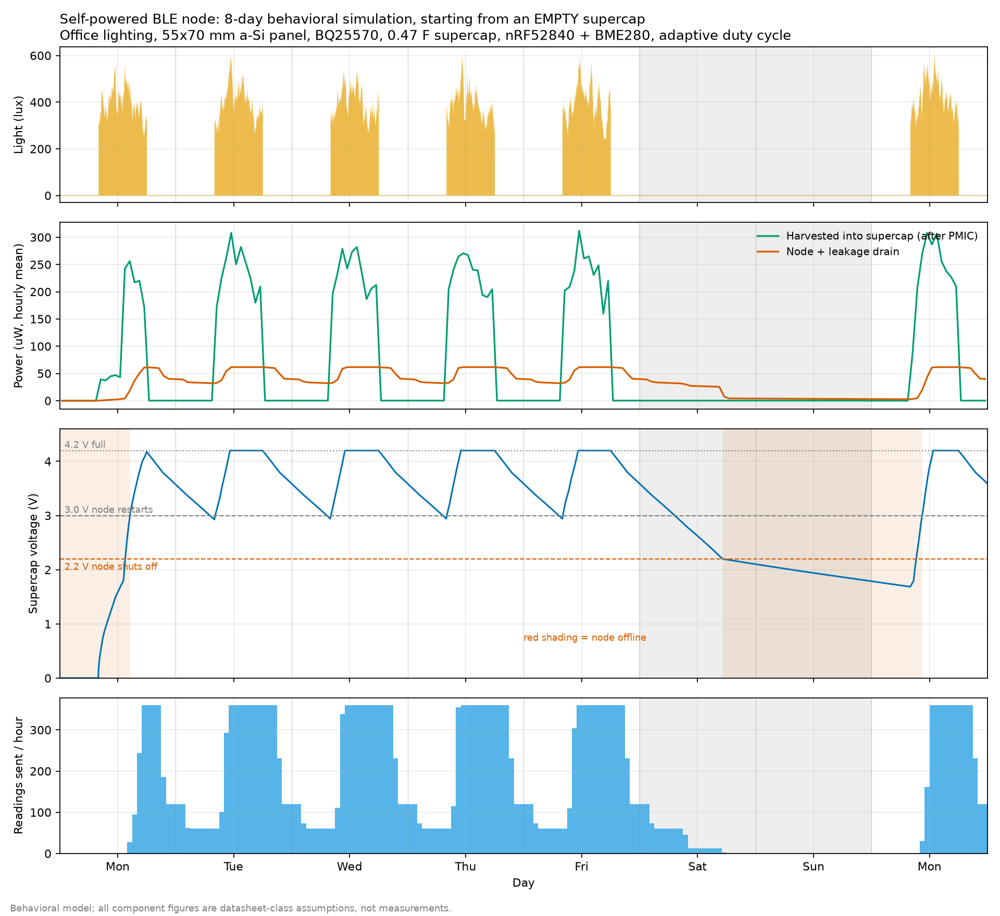
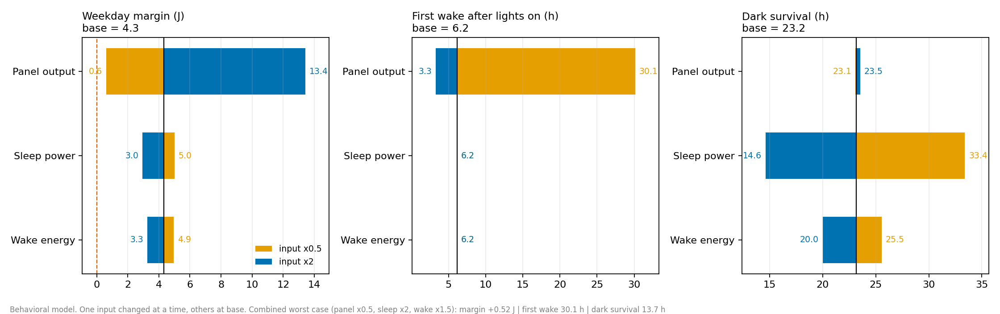

# Energy Budget Modeling of a Battery-less Indoor-Solar BLE Sensor Node

This project models whether a small indoor solar panel, a BQ25570 harvesting PMIC and a 0.47 F supercap can power a periodic BLE temperature and humidity sensor without a battery. It is a simulation and modeling study. It has not been built, and BLE transmission has not been tested.

## Scope: what is and isn't covered

| Piece | Status |
|---|---|
| Solar + PMIC + supercap energy balance | Modeled in Python (assumed numbers) |
| Adaptive duty cycling | Modeled as a rule, no firmware |
| Supercap ESR vs BLE burst | Modeled in Python (assumed ESR and burst) |
| Wake, read, encode, sleep cycle | Simulated in Wokwi on an ESP32-C3 + DHT22 (stand-ins) |
| BLE advertising / phone reception | Not shown (Wokwi can't simulate BLE) |
| nRF52840 firmware, BME280 | Not written / not simulated |
| Piezo harvesting, OLED | Not modeled |
| Real hardware and measurements | None |

Target design: 55x70 mm a-Si panel, BQ25570, 0.47 F supercap, nRF52840 + BME280.

## Key results (office lighting, assumed numbers)

- On a normal weekday the node harvests about 2x what it uses.
- A weekend of darkness drains the cap and the node shuts off about 23 h after the lights go out. It restarts by itself a few hours after light returns.
- Starting from an empty cap takes hours of light. This depends heavily on panel output.
- A bigger supercap does not fix the weekend, because leakage grows with size.
- A high-ESR supercap can brown out the node during a BLE burst unless there is a buffer capacitor.
- Panel output is the most sensitive assumption. Halving it nearly removes the weekday margin.




## Run it

```
pip install -r requirements.txt
cd Models
python energy_model.py
python esr_burst.py
python sensitivity.py
```
Charts are saved into the folder you run from. All assumptions are in the `Params` block of `energy_model.py`.

## Firmware demo

The `Firmware` folder holds the Wokwi project (ESP32-C3 + DHT22): [https://wokwi.com/projects/476770632788987905]. It shows the wake, read, encode and sleep cycle. The DHT22 stands in for the BME280, and BLE is not simulated. The wake counter resets each cycle in the simulator.

## Limitations

All component figures (panel output, sleep power, wake energy, ESR) are datasheet-class assumptions and are not validated against hardware. The PMIC efficiency curve is approximate. The "dim home" light profile is invented.

## Next steps

Build it, measure the real panel output at the target light levels, and write the nRF52840 firmware.

Author: Bhushan Rane
